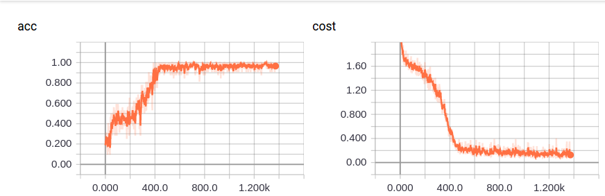

# Method
## 1-EMNLP2014 Convolutional Neural Networks for Sentence Classification

## 2-AAAI2015 Recurrent Convolutional Neural Networks for Text Classification

## 3-NAACL2016 Hierarchical Attention Networks for Document Classification

# Experiments
## Data
### Question Classification (QC 2002)
http://cogcomp.org/Data/QA/QC/

| type | objective | average length | class | Lan
| ------ | ------ | ------ | ------ | ------ |
| sentence | question types | 10 | 6 | English

### NLPCC 2017 News headline Classification
https://github.com/FudanNLP/nlpcc2017_news_headline_categorization

| type | objective | average length | class | Lan
| ------ | ------ | ------ | ------ | ------ |
| sentence | news headline | 10 | 6 | Chinese

## kim cnn train

    Epoch 8:
        cost: 0.00420041548721
        train acc: 0.974217844728
        test acc: 0.964

