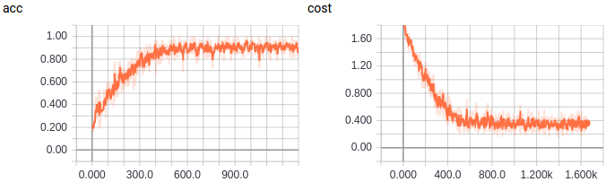
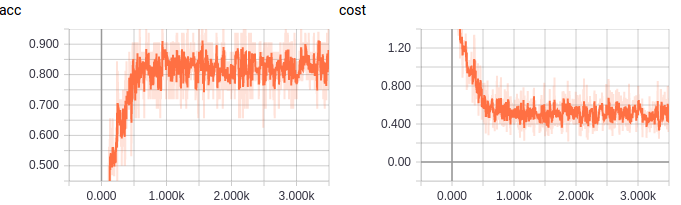
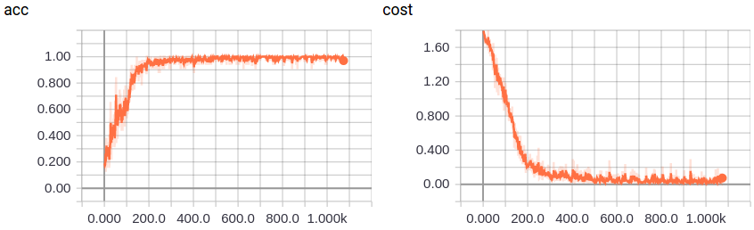
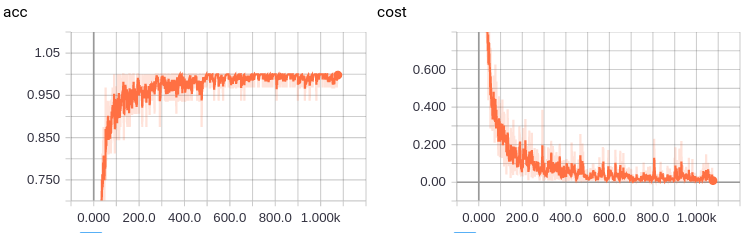
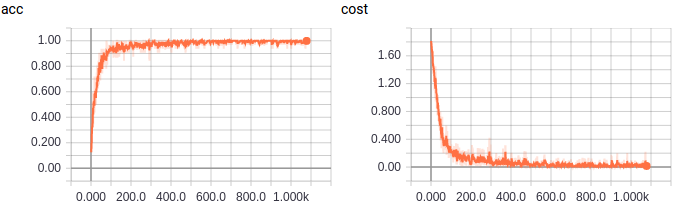
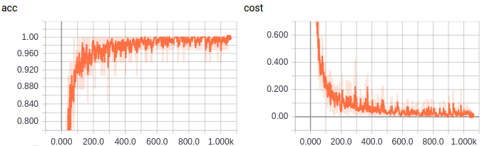
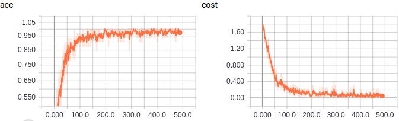
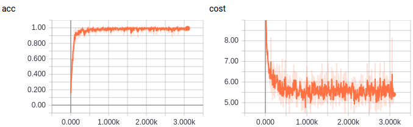
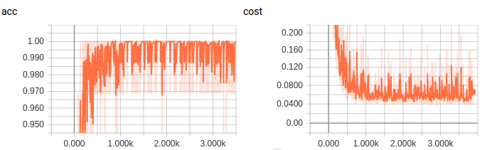
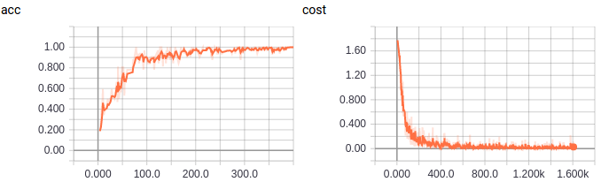

# Method
## 1-EMNLP2014 Convolutional Neural Networks for Sentence Classification

## 2-AAAI2015 Recurrent Convolutional Neural Networks for Text Classification

## 3-NAACL2016 Hierarchical Attention Networks for Document Classification

## 4-ICLR2017 A Structured Self-attentive Sentence Embedding

# Experiments
## 2D - viewer
can be find in folder
[view](file:/viewr)

## Question Classification (QC 2002)
http://cogcomp.org/Data/QA/QC/

| type | objective | average length | class | train/test | Lan|
| ------ | ------ | ------ | ------ | ------ | ------ |
| sentence | question types | 10 | 6 | 15452/500 | English|

#### AVG (average word embedding) training

    Epoch 0: train cost: 0.0157731532153, acc: 0.856604866744
    Epoch 0: test acc: 0.914
    Epoch 1: train cost: 0.011120560211, acc: 0.90527230591
    Epoch 1: test acc: 0.926
    Epoch 2: train cost: 0.0110226789984, acc: 0.899188876014
    Epoch 2: test acc: 0.93
    Epoch 3: train cost: 0.0108223813667, acc: 0.898899188876
    Epoch 3: test acc: 0.93
    Epoch 4: train cost: 0.0105730641033, acc: 0.910486674392
    Epoch 4: test acc: 0.93
    Epoch 5: train cost: 0.0107601115206, acc: 0.901796060255
    Epoch 5: test acc: 0.93
    Epoch 6: train cost: 0.0109058949116, acc: 0.905561993048
    Epoch 6: test acc: 0.93
    Epoch 7: train cost: 0.010843385788, acc: 0.897740440324
    Epoch 7: test acc: 0.93
    Epoch 8: train cost: 0.0106531062346, acc: 0.91077636153
    Epoch 8: test acc: 0.93
    Epoch 9: train cost: 0.0101846210305, acc: 0.912224797219
    Epoch 9: test acc: 0.93

#### AVGTFIDF (average word embedding tfidf) training

    Epoch 0: train cost: 0.0227936226724, acc: 0.743337195829
    Epoch 0: test acc: 0.858
    Epoch 1: train cost: 0.0163344583568, acc: 0.823001158749
    Epoch 1: test acc: 0.888
    Epoch 2: train cost: 0.015335006076, acc: 0.832560834299
    Epoch 2: test acc: 0.892
    ...
    Epoch 9: train cost: 0.0152274934685, acc: 0.83516801854
    Epoch 9: test acc: 0.892

#### kim cnn training

    Epoch 2:
        cost: 0.00132063299802
        train acc: 0.989860950174
        dev acc: 0.974

#### GRU training

    Epoch 1:
        cost: 0.000869356350728
        train acc: 0.992178447277
        dev acc: 0.984

#### GRU-CNN training

    Epoch 3:
        train cost: 0.000631529912567
        train acc: 0.993626882966
        dev acc: 0.984

#### RCNN training

    Epoch 1:
        train cost: 0.00179642121795
        train acc: 0.980011587486
        dev acc: 0.98
    Epoch 2:
        train cost: 0.000787947041509
        train acc: 0.992757821553
        dev acc: 0.982
    Epoch 3:
        train cost: 0.000631529912567
        train acc: 0.993626882966
        dev acc: 0.984

#### RNN-ATT training

    Epoch 1:
        train cost: 0.00179642121795
        train acc: 0.980011587486
        dev acc: 0.98
    Epoch 2:
        train cost: 0.000787947041509
        train acc: 0.992757821553
        dev acc: 0.982
    Epoch 3:
        train cost: 0.000631529912567
        train acc: 0.993626882966
        dev acc: 0.984

#### Structured Self-attentive training

    Epoch 1:
        train cost: 0.179252121705, acc: 0.960892236385
        dev acc: 0.968
    Epoch 2:
        train cost: 0.174375187066, acc: 0.985225955968
        dev acc: 0.972
    ....
    ....
    Epoch 8:
        train cost: 0.172080848612, acc: 0.985515643105
        dev acc: 0.972

### GRU with Center Loss

    Epoch 0: train cost: 0.00327359643783, acc: 0.98348783314
    Epoch 0: test acc: 0.974
    Epoch 1: train cost: 0.00208708796292, acc: 0.991888760139
    Epoch 1: test acc: 0.98
    Epoch 2: train cost: 0.00197653938085, acc: 0.99449594438
    Epoch 2: test acc: 0.976
    Epoch 3: train cost: 0.00187900724474, acc: 0.996234067207
    Epoch 3: test acc: 0.978

### Center Divide

    Epoch 0: train cost: 0.00184123501496, acc: 0.982908458864
    Epoch 0: test acc: 0.974
    Epoch 1: train cost: 0.000830719525279, acc: 0.991888760139
    Epoch 1: test acc: 0.974
    Epoch 2: train cost: 0.000683305005285, acc: 0.993047508691
    Epoch 2: test acc: 0.978
    Epoch 3: train cost: 0.000309743383767, acc: 0.997392815759
    Epoch 3: test acc: 0.982
    Epoch 4: train cost: 0.000337060144333, acc: 0.995654692932
    Epoch 4: test acc: 0.986

## NLPCC 2017 News headline Classification
https://github.com/FudanNLP/nlpcc2017_news_headline_categorization

| type | objective | average length | class | train/dev/test | Lan
| ------ | ------ | ------ | ------ | ------ |  ------ |
| sentence | news headline | 10 | 6 | 0/0/0 |Chinese

